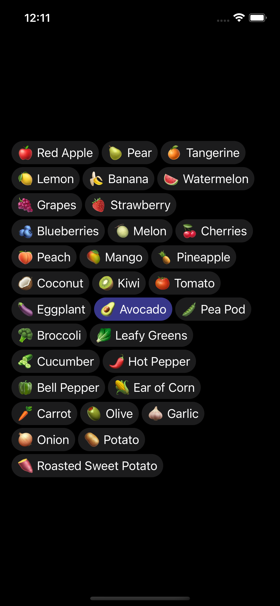

# WStack

WStack is a package for SwiftUI that provides a simple and intuitive way to wrap multiple views within an HStack. If you've ever struggled with aligning and spacing views within an HStack, this package can save you time and frustration.

With Wrapping HStack, you can easily create a horizontal stack of views that automatically wraps to the next line when it reaches the edge of the screen. You can also adjust the spacing and alignment of the views within the HStack to fit your design needs.

Features include:

- Automatic wrapping of views within the HStack
- Adjustable spacing and alignment of views
- Compatible with SwiftUI

Installation is simple and can be done via Swift Package Manager.

Overall, WStack is a powerful and flexible package that can help simplify your SwiftUI development process and create more dynamic and responsive layouts.



## Usage

```swift
import SwiftUI
import WStack

struct ContentView: View {
    let fruits = [
        "🍎 Red Apple",
        "🍐 Pear",
        "🍊 Tangerine",
        "🍋 Lemon",
        "🍌 Banana",
        "🍉 Watermelon",
        "🍇 Grapes",
        "🍓 Strawberry",
        "🫐 Blueberries",
        "🍈 Melon",
        "🍒 Cherries",
        "🍑 Peach",
        "🥭 Mango",
        "🍍 Pineapple",
        "🥥 Coconut",
        "🥝 Kiwi",
        "🍅 Tomato",
        "🍆 Eggplant",
        "🥑 Avocado",
        "🫛 Pea Pod",
        "🥦 Broccoli",
        "🥬 Leafy Greens",
        "🥒 Cucumber",
        "🌶️ Hot Pepper",
        "🫑 Bell Pepper",
        "🌽 Ear of Corn",
        "🥕 Carrot",
        "🫒 Olive",
        "🧄 Garlic",
        "🧅 Onion",
        "🥔 Potato",
        "🍠 Roasted Sweet Potato"
    ]

    var body: some View {
        ScrollView {
            VStack(alignment: .leading) {
                WStack(fruits, spacing: 4, lineSpacing: 4) { fruit in
                    Text(fruit)
                        .padding(.vertical, 6)
                        .padding(.horizontal, 8)
                        .background(
                            fruit == "🥑 Avocado" ?
                                Color.indigo.opacity(0.6) :
                                Color.secondary.opacity(0.2)
                        )
                        .cornerRadius(20)
                }
            }
            .padding()
        }
    }
}

struct ContentView_Previews: PreviewProvider {
    static var previews: some View {
        ContentView()
    }
}
```
